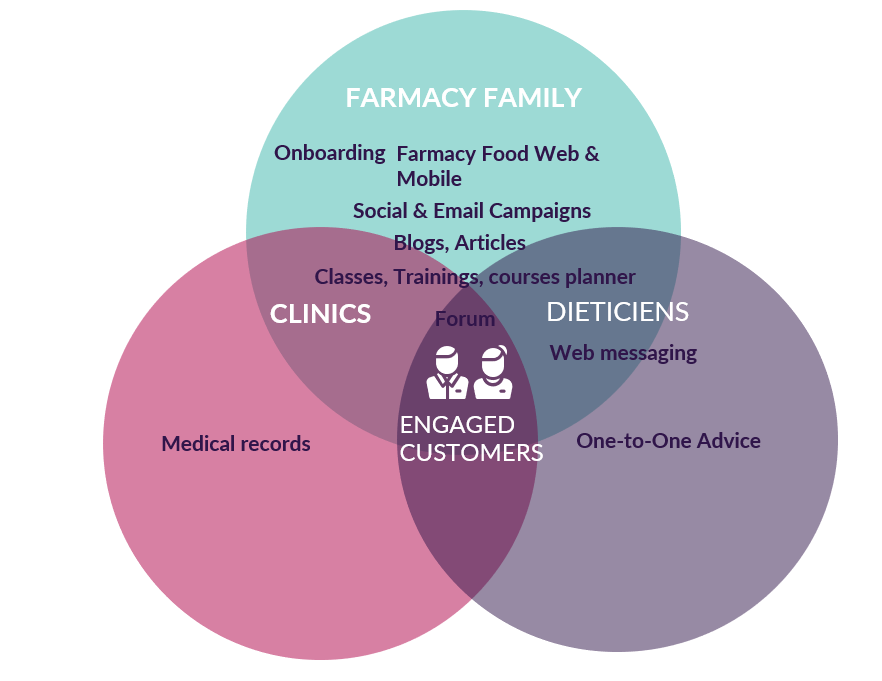
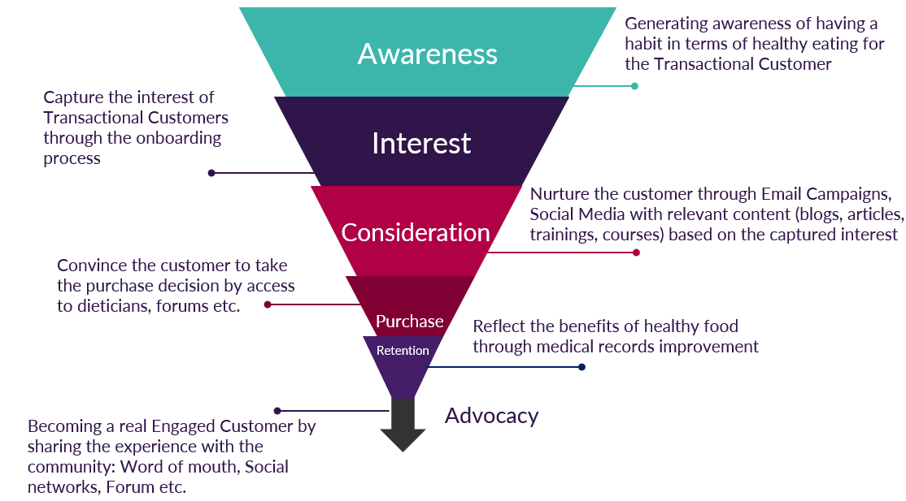
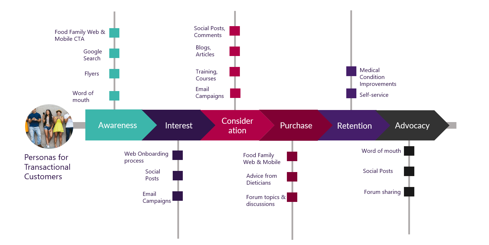

## Conceptualization

Farmacy Family is aimed to create a digital ecosystem for addressing the end customers (Engaged Customers) through various channels and/or touch points by Farmacy Food Brand, Clinics and Dieticians, allowing them to get onboard a **healthy lifestyle journey** and becoming **brand ambassador in their communities**.

The scope of the Farmacy Family, in the first Phase, is described in the following sub-chapters in the form of:
- targeted **Customer Segments**
- **Channels of Engagement** and
- **Engaged Customer Journey** (with possibility of growing the concept as **Further Extensions**)

# Customer Segments
The targeted Customer groups that are addressed by the Farmacy Family, are the following:
- low income families
- elderly people
- students
- first responders
- people with medical conditions

Nevertheless, the system is designed to accommodate/configure additional Customer Segments by combining the bellow Perspectives (**e.g. Income < 27000 USD AND persons in household >=5 AND Address.Home.State is Louisiana**) or any other attributes available on the Customer Profile.

| Customer Perspectives | Notes |
| Income | Gathered during the Onboarding Process range reference: https://www.federalregister.gov/documents/2021/02/01/2021-01969/annual-update-of-the-hhs-poverty-guidelines |
| Persons in family/household | Gathered during Onboarding Process |
| Medical condition | Gathered during Onboarding Process (e.g. Diabetes, Obesity, High cholesterol etc.) |
| Age | Gathered from Transactional Customer |
| Address | Gathered from Transactional Customer (for location based engagement and targeting) |
| Order history | Gathered from Transactional Customer |
| Engagement score | Computed by Customer Profile Application (based o a set of scoring rules and mechanism) |
| Sentiment analysis score | Computed by Sentiment Analysis Service |
| Social interests and likes | Gathered by the Identity Provider System (once the customer is logged in via Facebook, if the permissions are granted, the system can collect Facebook profile information such as interests or likes) |

# Channels of Engagement
The following channels and touch-points are in scope for the **first Phase** of Farmacy Family.
Of course, the engagement channels can be extended in the future, based on analytical data/studies that reflect the customers’ behaviour in terms of healthy food.

| Channel/Touch-points in scope | Description |
| Web Shop & Mobile App | - Onboarding process available on Responsive Web   - Channel used for the ordering process |
| Forum | - Channel for generating discussion topics and  building communities   - Channel used for user generated content   - Channel used also by Clinics, Dieticians to raise awareness |
| Interactive media library (articles & blog) | - Channel used for raising awareness of healthy diets impact on life |
| Email Campaigns | - Channel used to deliver relevant content to the targeted segments   - Channel used for nurturing the transactional customer into engaged customer |
| Social Media | - Channel used to raise awareness and interest of healthy diets, products etc. on Social media   - Channel used to gather the social engagement |
| Clinics | - Channel used to gather the medical records and create advocacy around the improvements of the medical condition |
| Dieticians | - Channel used to address the interested customers in getting a personalized diet/advice from a professional, advice that will contribute to the purchase decision |Channel used to raise awareness and interest
| Courses/Training Planner | - Channel used to deliver relevant courses/trainings to the targeted segments   - Channel used to raise awareness and interest |

As part of Further Extensions we would also recommend, as channels of engagement, the following:
- Loyalty Program
- Restaurants (or places where the community meets)

# Engagement Customer Journey
In order for Farmacy Family to reach its objectives, as stated in previous chapters, a funnel (or multiple funnels for each customer segment) must be engineered, a funnel that reflects the **journey of a Transactional Customer to an Engaged Customer**.

- **AWARENESS**: What is my audience and how to make it aware of the brand?
- **INTEREST**: How to capture the interest of the people I have reached to?
- **CONSIDERATION**: How to convince the customer that my product best fits his/her needs?
- **PURCHASE**: How to create a convenient way for customer to buy my product?
- **RETENTION**:  How to retain the customers I’ve acquired?
- **ADVOCACY**: How can I make my customer a brand ambassador, so that brand awareness spreads within the community (back to AWARENESS funnel step)?

The Farmacy Family Solution will enable Campaign Managers to easily create and design the engaged customer journey as depicted in the above image.

Of course, the journey of each individual is not as linear as depicted above and it’s important to empower the customers to script their own journey, allowing them to choose the way they interact with the available channels and touch-points. As depicted bellow, connecting the dots within the journey will depend on each and every customer and their desired way of interaction, resulting an infinite number of journeys.

