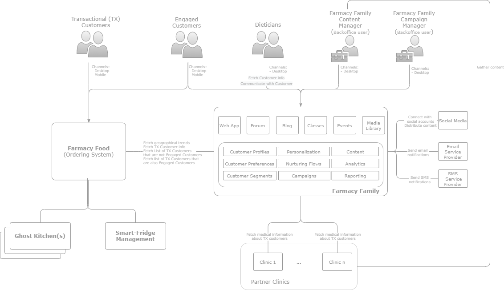

## Context View

The following diagrams present the solution context, namely: 
- the list of users along with the channels they are interacting on
- how would the **Farmacy Family** fit into the Client’s architectural landscape and the systems it has to integrate with

## Users and Roles
The application is used by a list of types of Users defined in the [Functional Requirements](../../SoftwareRequirementsSpecifications.md) and [User Profile](UserProfile.md).

## Integrated Systems
The systems from the Client landscape that are integrated with the Farmacy Family and their responsibilities are detailed in the [Integration View](../05IntegrationView.md).
