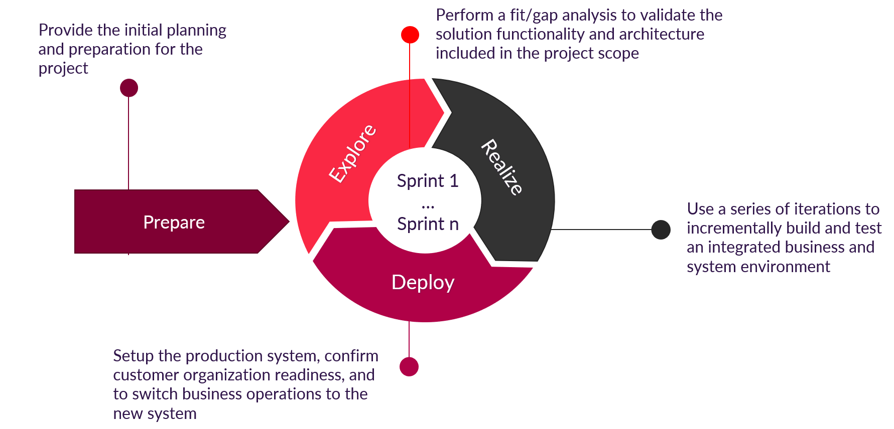

## Software Requirements Specifications
The Software Requirements Specifications is composed from Functional Requirements and Non-Functional Requirements (detailed as part of the [Quality View](./SoftwareArchitectureDocument/07QualityView.md) ) describing how the Family Farmacy System will function and perform.

### Functional Requirements
The functional requirements are modeled as User and/or System Stories, grouped by user/system perspective, with the purpose of building up a Backlog for the development team. Of course, the stories need to be further refined and detailed for each Sprint if we consider a SCRUM based development process. We recommend the following iterative development approach, starting with:
  - **Preparation phase**: initial project planning
  - **Iterative phases, as Sprints**:
    - **Explore**: Backlog Prioritization, Backlog Refinement, Sprint Planning 
    - **Realize**: Implementation
    - **Deploy**: Deploy to QA, Testing, Deploy to PreProd, UAT, Deploy to Production

#### Users and Systems
  - Transactional Customer
  - Engaged Customer
  - Campaing Manager/Content Manager
  - Dietician
  - Clinic
  - Farmacy Food
  - Farmacy Family

**Farmacy Foods**
  - The Farmacy Food system needs to interrogate Farmacy Family in order to find out if a customer is an Engaged Customer.
  - The Farmacy Food system needs to send to Farmacy Family lists of Transactional Customers so the Transactional Customers can be contacted for the Farmacy Family on-boarding process.
  - The Farmacy Food system sends to Farmacy Family information about the orders placed by Engaged Customer so that the eating habits of the Engaged Customer can be updated in their profile and the Campaign Manager can use this information to create customer segments.
  - The Farmacy Food system sends to Farmacy Family comments posted for Farmacy Foods products and/or orders so that the Sentiment Analysis component can update the sentiment score attached to the users profile.
  - The Farmacy Food system reads from Farmacy Family information about geographical food consumption trends in order to optimize food delivery.
  - The Farmacy Food system reads from Farmacy Family information about food consumption statistics for Engaged Customer in order to optimize food delivery.
  - The Farmacy Family system sends to Transactional Customers, e-mail invitations to create an account on Farmacy Family as part of the on-boarding process.
  - As a Transactional Customer I can access the Farmacy Family web or mobile interface in order to create a Farmacy Family account.
  - As an Engaged Customer I can access the web or mobile Farmacy Family interface in order to update account information or settings.

**Transactional Customer**
  - As a Transactional Customer I can receive an email invitation from Farmacy Family in order to start the on-boarding process by which I can become an Engaged Customer.
  - As a Transactional Customer I can access the Farmacy Family web or mobile interface in order to go through the on-boarding process by which I can become an Engaged Customer.

**Dieticians**
  - As a Dietician I can create a Farmacy Family account in order to request permission about using the Farmacy Family system.
  - The Farmacy Family system will set the initial state of the Dieticians account as disabled in order to avoid unverified accounts from spamming the system.
  - As a Content Manager I will be able to review the disabled Dieticians accounts in order to verify the authenticity of account information and enable the account if the account information is authentic.
  - As a Dietician I will be able to use the Farmacy Family account in order to access the Farmacy Family features only after the account has been enabled.
  - As a Dietician I will be automatically notified via e-mail when the Farmacy Family account is activated.
  - As a Dietician, with an enabled account, I can create Forum pages on Farmacy Family in order to promote my services and make generic diet recommendations.
  - As a Dietician, with an enabled account, I can upload media content to the Farmacy Family Media Library in order to promote my services and make generic diet recommendations.
  - As a Dietician, with an enabled account, I can create Blog pages on Farmacy Family in order to distribute information about my services or generic diet recommendations.
  - As a Dietician, with an enabled account, I can plan and deliver Classes in order to promote my services and make generic diet recommendations.
  - As a Dietician, with an enabled account, I can organize and deliver virtual or live Events in order to promote my services or make generic diet recommendations.
  - As a Dietician, with an enabled account, I can use the Farmacy Family online conferencing system in order to deliver virtual Events or Classes.
  - As an Engaged Customer I can contact Dieticians via private message channels in order to get personalized diet recommandations.
  - As a Dietician I can interact with Engaged Customers via private message channels initiated by the Engaged Customers in order to make personalized diet recommandations.
  - As an Engaged Customer I can configure in my account what medical information can be viewed by which Dieticians in order to restrict access to my medical information.
  - As a Dietician I have to sign a confidentiality consent form in order to view the medical records of the Engaged Customer that allowed this.
  - As a Dietician I can propose personalized diets, exercises, gyms, trainers, applications to Engaged Customer via direct message channels initiated by the Engaged Customers in order to help them achieve their health objectives..

**Clinics**
  - The Farmacy Family system can fetch from partner clinics information about the medical test results of Engaged Customers in order to enable Engaged Customers to easily share medical information with Dieteticians.
  - As a Content Manager I can post on Farmacy Family Forums, Media library or Classes, promotional materials supplied by the Clinics in order to inform Engaged Customers about the offers of partner Clinics.

**Engaged Customer**
  - As an Engaged Customer I will be able to Read and Write messages on the Farmacy Family Forum in order to discuss with Dieticians or other Engaged Customer topics, related to Healthy Food, that interest to me.
  - As an Engaged Customer I will be able to attend Classes  in order to learn about Healthy Food or services provided by Dieticians and Clinics.
  - As an Engaged Customer I will be able to attend live or virtual Events in order to learn about Healthy Food or services provided by Dieticians and Clinics.
  - As an Engaged Customer I will be able to use the Farmacy Family conferencing system in order to attend virtual Events .
  - As an Engaged Customer I will get notified by Farmacy Family about upcoming events and classes.
  - As an Engaged Customer I will be able to view content from the Media Library in order to learn about Healthy Food or services provided by Dieticians and Clinics.
  - As an Engaged Customer I will be able to read the Farmacy Family Blogs in order to learn about Healthy Food or services provided by Dieticians and Clinics.
  - As an Engaged Customer I will be able to post comments on Farmacy Family Blogs in order to provide feedback to the article authors.
  - As an Engaged Customer I will be able to use the integrated Farmacy Family search engine in order to find relevant information in the Farmacy Family Forum, Blogs, Media Library.
  - As an Engaged Customer I will be able to use the integrated Farmacy Family search engine in order to find Classes, Event and Dieticians registered on Farmacy Family.
  - As an Engaged Customer I will be able to browse through a list of Dieticians, registered on Farmacy Family, in order to select and contact a Dietician of my choosing.

**Farmacy Family**
  - The Farmacy Family system keeps track of the food orders of Engaged Customers in order to group Engaged Customers in to customer segments.
  - The Farmacy Family system uses the orders information of Engaged Customers the generate geographical food consumption trends.
  - The Farmacy Family system scans all the messages published on forums and using a third-party sentiment analysis service will allocate to each Engaged Customer, that published on the forum, a sentiment score.

**Campaign Manager**
  - As a Campaign Manager I will be able to create Customer Segments based on the User Profile attributes in order to create targeted marketing campaigns.
  - As a Campaign Manager I will be able to define and manage Campaigns via Email/SMS/Social Media in order to attract more Farmacy Foods and Farmacy Family customers.
  - As a Campaign Manager I will be able to define and trigger Nurturing Flows to target specific Customer Segments via Campaigns  in order to attract more Farmacy Foods and Farmacy Family  customers.
  - As a Campaign Manager I will be able to visualize reports regarding Campaign interaction in order to optimize targeting of future Campaigns.

#### Out of Scope Functional Requirements
The following features are considered out of scope of the designed Solution:
- Patient management & appointments for each Clinic is not done in the Family Farmacy solution (but rather on the Clinic’s own systems)
