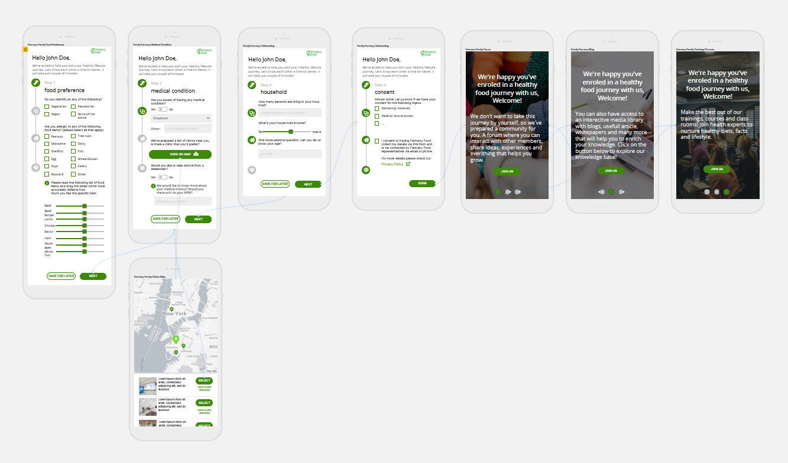

## User Experience

We opted for a **mobile first design** for the on-boarding process, having 4 major steps in order to capture the Transactional Customer’s data:
  - food preference
  - medical information
  - household information
  - consent

The customer will have the option to save the progress of the on-boarding and continue later from the same step.
After we have captured the information (step 4, having the consent), there will be 3 screens that will guide the customer on how to use the Farmacy Family channels:
  - Forums
  - Interactive media library (blogs, articles etc.)
  - Courses/training Planner

The entry point for the On-boarding process (email trigger after placing the order on Farmacy Food) can be extended to a lot of different touch-points, in order to persuade the customer in enrolling on Farmacy Family:
  - Email campaigns for the Transaction customers
  - Social Media campaigns
  - Flyers (QR code to the onboarding process) 
  - Farmacy Food Call To Action
  - Word of Mouth
  - etc.

### User Experience Architecture

### Screens
| Screen name| Screen |
| ---------------------------------------|-----------------------------------------------------------------------------------------------------------------------------|
|Farmacy Family Food Preference||
|Farmacy Family Food Medical Information||
|Farmacy Family Food Clinics Map||
|Farmacy Family Food Household Information||
|Farmacy Family Food Consent||
|Farmacy Family Food Forum, Interactive Media Library, Courses/Trainings Planner||
